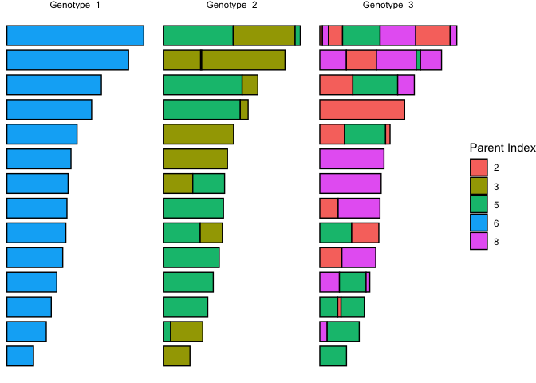
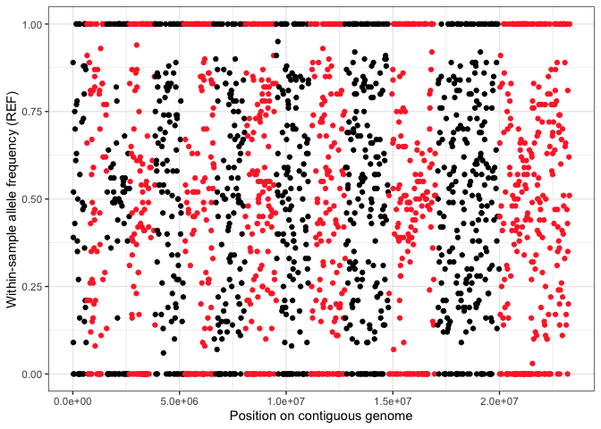

<!-- README.md is generated from README.Rmd. Please edit that file -->

# recombuddy

<!-- badges: start -->

<!-- badges: end -->

The goal of recombuddy is to …

## Installation

Install recombuddy from [GitHub](https://github.com/) with:

``` r
install.packages("devtools")
devtools::install_github("PlasmoGenEpi/recombuddy")
```

## Example

This is a basic example which shows you how to solve a common problem:

``` r
library(recombuddy)
set.seed(1)

# define the number of samples in the initial sample set
n_set <- 10

# define concentration parameter of the Dirichlet distribution
f <- 0.1
alpha <- (1 - f) / f

# draw proportions of each member of the sample set
set_props <- rdirichlet(n_set, alpha = alpha)

# simulate a single sample
MOI <- 3
sim <- sim_sample(k = c(0, 1, 2), rho = 6e-7, set_props = set_props)

names(sim[[1]])
#> [1] "is_nonrecomb"    "index_nonrecomb" "segments"
```

``` r

sim[[1]]$is_nonrecomb
#> [1] TRUE
```

``` r
sim[[1]]$index_nonrecomb
#> [1] 6
```

``` r

sim[[2]]$is_nonrecomb
#> [1] FALSE
```

``` r
sim[[2]]$index_nonrecomb
#> [1] NA
```

``` r

sim[[1]]$segments
#> # A tibble: 14 × 4
#>    chrom start     end index
#>    <int> <dbl>   <dbl> <int>
#>  1     1     1  640851     6
#>  2     2     1  947102     6
#>  3     3     1 1067971     6
#>  4     4     1 1200490     6
#>  5     5     1 1343557     6
#>  6     6     1 1418242     6
#>  7     7     1 1445207     6
#>  8     8     1 1472805     6
#>  9     9     1 1541735     6
#> 10    10     1 1687656     6
#> 11    11     1 2038340     6
#> 12    12     1 2271494     6
#> 13    13     1 2925236     6
#> 14    14     1 3291936     6
```

``` r

sim[[2]]$segments
#> # A tibble: 23 × 4
#>    chrom  start     end index
#>    <int>  <dbl>   <dbl> <int>
#>  1     1      1  640851     3
#>  2     2      1  176820     5
#>  3     2 176821  947102     3
#>  4     3      1 1067971     5
#>  5     4      1 1200490     5
#>  6     5      1 1343557     5
#>  7     6      1  886405     5
#>  8     6 886406 1418242     3
#>  9     7      1 1445207     5
#> 10     8      1  708169     3
#> # ℹ 13 more rows
```

``` r

sim[[3]]$segments
#> # A tibble: 36 × 4
#>    chrom   start     end index
#>    <int>   <dbl>   <dbl> <int>
#>  1     1       1  640851     5
#>  2     2       1  176050     8
#>  3     2  176051  947102     5
#>  4     3       1  430563     5
#>  5     3  430564  510132     2
#>  6     3  510133 1067971     5
#>  7     4       1  470993     8
#>  8     4  470994 1111055     5
#>  9     4 1111056 1200490     8
#> 10     5       1  530693     2
#> # ℹ 26 more rows
```

``` r

# get all genotypes into a single table
df_all_genotypes <- get_all_genotypes(sim)
df_all_genotypes
#> # A tibble: 73 × 5
#>    genotype chrom start     end index
#>       <int> <int> <dbl>   <dbl> <int>
#>  1        1     1     1  640851     6
#>  2        1     2     1  947102     6
#>  3        1     3     1 1067971     6
#>  4        1     4     1 1200490     6
#>  5        1     5     1 1343557     6
#>  6        1     6     1 1418242     6
#>  7        1     7     1 1445207     6
#>  8        1     8     1 1472805     6
#>  9        1     9     1 1541735     6
#> 10        1    10     1 1687656     6
#> # ℹ 63 more rows
```

``` r

# plot
plot_genotypes(df_all_genotypes)
```



## Title

``` r
# draw positions of loci along the genome
df_loci <- draw_loci(n_loci = 2e3)
df_loci
#> # A tibble: 2,000 × 2
#>    chrom    pos
#>    <int>  <int>
#>  1     1  10624
#>  2     1  22822
#>  3     1  24024
#>  4     1  24269
#>  5     1  30949
#>  6     1  72421
#>  7     1  87937
#>  8     1  91692
#>  9     1 105280
#> 10     1 136112
#> # ℹ 1,990 more rows
```

``` r

# draw population-level allele frequencies (PLAFs) at specified loci
df_PLAF <- draw_PLAF(df_loci = df_loci)
df_PLAF
#> # A tibble: 2,000 × 3
#>    chrom    pos  PLAF
#>    <int>  <int> <dbl>
#>  1     1  10624 0.383
#>  2     1  22822 0.355
#>  3     1  24024 0.481
#>  4     1  24269 0.484
#>  5     1  30949 0.610
#>  6     1  72421 0.419
#>  7     1  87937 0.330
#>  8     1  91692 0.355
#>  9     1 105280 0.585
#> 10     1 136112 0.557
#> # ℹ 1,990 more rows
```

``` r

# draw alleles for each member of sample set
df_sample_set <- draw_sample_set_WSAF(df_PLAF = df_PLAF, n_set = n_set)
df_sample_set
#> # A tibble: 20,000 × 4
#>    chrom   pos index  WSAF
#>    <int> <int> <int> <dbl>
#>  1     1 10624     1     0
#>  2     1 10624     2     1
#>  3     1 10624     3     1
#>  4     1 10624     4     0
#>  5     1 10624     5     0
#>  6     1 10624     6     1
#>  7     1 10624     7     0
#>  8     1 10624     8     0
#>  9     1 10624     9     1
#> 10     1 10624    10     0
#> # ℹ 19,990 more rows
```

``` r

# draw proportions for each genotype
df_genotype_props <- draw_genotype_props(MOI = MOI, alpha = 10)
df_genotype_props
#> # A tibble: 3 × 2
#>   genotype  prop
#>      <int> <dbl>
#> 1        1 0.545
#> 2        2 0.294
#> 3        3 0.161
```

``` r

# calculate true within-sample allele frequencies (WSAFs) for the entire sample
df_WSAF <- get_WSAF(df_all_genotypes = df_all_genotypes,
                    df_sample_set = df_sample_set,
                    df_genotype_props = df_genotype_props)
df_WSAF
#> # A tibble: 2,000 × 3
#>    chrom    pos  WSAF
#>    <int>  <int> <dbl>
#>  1     1  10624 0.839
#>  2     1  22822 0.455
#>  3     1  24024 0    
#>  4     1  24269 0.161
#>  5     1  30949 0.455
#>  6     1  72421 0    
#>  7     1  87937 0.706
#>  8     1  91692 0.455
#>  9     1 105280 0.706
#> 10     1 136112 0.706
#> # ℹ 1,990 more rows
```

``` r

# apply a simple read count model
df_counts <- draw_read_counts(df_WSAF = df_WSAF)
df_counts
#> # A tibble: 2,000 × 4
#> # Rowwise: 
#>    chrom    pos   REF   ALT
#>    <int>  <int> <dbl> <dbl>
#>  1     1  10624    89    11
#>  2     1  22822    39    61
#>  3     1  24024     0   100
#>  4     1  24269     9    91
#>  5     1  30949    52    48
#>  6     1  72421     0   100
#>  7     1  87937    75    25
#>  8     1  91692    43    57
#>  9     1 105280    70    30
#> 10     1 136112    61    39
#> # ℹ 1,990 more rows
```

``` r

# plot read counts
plot_read_counts(df_counts = df_counts)
#> Joining with `by = join_by(chrom)`
```


