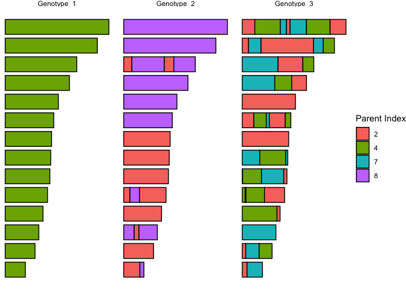
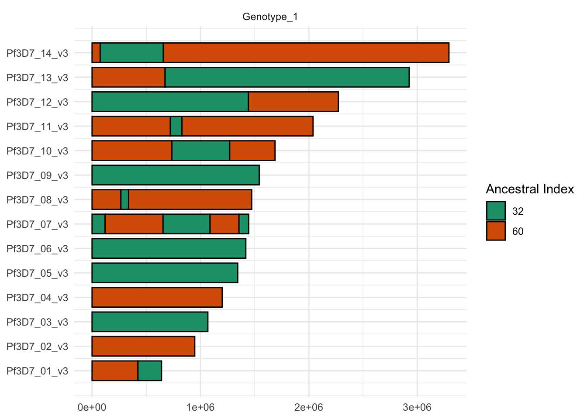

<!-- README.md is generated from README.Rmd. Please edit that file -->

# recombuddy

<!-- badges: start -->

<!-- badges: end -->

The goal of *recombuddy* is to simulate *Plasmodium falciparum* genetic
data in a way that captures realistic patterns of polyclonality and
within-sample relatedness. It achieves this using a simple statistical
model of recombination, where the genome is partitioned into blocks that
each inherit from a specified ancestral haplotype. This approach allows
for the generation of mosaic genomes that reflect the structure and
complexity commonly observed in real infections, while avoiding full
genomic transmission modelling.

## Installation

Install recombuddy from [GitHub](https://github.com/) with:

``` r
install.packages("devtools")
devtools::install_github("PlasmoGenEpi/recombuddy@v1.0.0")
```

Notice we have used a tagged version number here to avoid issues with
backward compatibility.

## Example

There are two main methods for simulating genetic data in recombuddy:

1.  **Using a “sample set” of real haploid genotypes (aka a reference
    panel)**. Simulation works by creating new haploid genotypes that
    are mosaics of the original the sample set. These haploid genotypes
    can be combined to produce polyclonal samples.
2.  **Creating entirely synthetic genotypes by drawing from an allele
    frequency distribution**. This works the same way as above, except
    the sample set is also simulated by drawing values from an allele
    frequency distribution at specified loci.

Both methods start the same way; by simulating blocks of inheritance.

### Simulating blocks of inheritance

``` r
library(recombuddy)
set.seed(1)
```

Let’s imagine we have 10 genotypes in our sample set.

``` r
n_set <- 10
```

Our first decision is how frequently each genotype should be sampled. In
many scenarios - such as low-transmission or outbreak settings - a small
number of genotypes may dominate the population. This step also allows
us to control the average relatedness *between* samples; that is, the
probability that haploid genotypes from two distinct individuals are
identical by descent (IBD) at a given locus.

Here, we take the statistically principled approach of drawing
proportions from a Dirichlet distribution. The concentration parameter
`alpha` dictates the skew of this distribution, with small values
leading to highly skewed distributions. High skew means a high chance of
sampling the same individual multiple times. Flipping this argument
around, if we define the parameter `f` to be the probability of identity
by descent $`Pr(IBD)`$ between two samples, then we can calculate
`alpha` directly from `f` as follows:

``` r
# define concentration parameter of the Dirichlet distribution directly from f
f <- 0.2
alpha <- (1 - f) / f

# draw proportions of each member of the sample set
set_props <- rdirichlet_single(n_set, alpha = alpha)
set_props
#>  [1] 0.009478167 0.081912664 0.023858816 0.045597922 0.696655093 0.001457516
#>  [7] 0.024172231 0.017633511 0.003904626 0.095329454
```

Next, we simulate a single polyclonal sample using `sim_sample()`.
Arguments to this function are:

- `k`: a vector of values specifying the number of serial meioses for
  each haploid genotype in the sample. There is one value per haploid
  genotype, meaning the length of this vector specifies the multiplicity
  of infection (MOI). When `k[i]=0` there is no meiosis, and values are
  copied over exactly from the sample set. When `k[i]=1` there is a
  single meiosis of two members of the sample set. When `k[i]=2` there
  are two serial meioses starting with four members of the sample set,
  and so on. Higher values of `k` tend to produce more blocks and
  smaller blocks, with the potential for more complex patterns of
  inheritance. A more detailed description of the statistical model is
  given below.
- `rho`: the recombination rate (per-site, per-meiosis). By default we
  use the value 7.4e-7 from Miles et al. (2016).
- `set_props`: the proportions of each member of the sample set.

Let’s generate a sample with MOI=3:

``` r
# simulate a single sample
k <- c(0, 1, 2)
MOI <- length(k)
samp1 <- sim_sample(k = k, rho = 7.4e-7, set_props = set_props)
```

The output of `sim_sample()` is a list with one element per haploid
genotype, so three elements in this example. Each haploid genotype has
the following components:

``` r
names(samp1[[1]])
#> [1] "is_nonrecomb"    "index_nonrecomb" "segments"
```

`is_nonrecomb` states whether this genotype was produced as a direct
copy from the sample set with no meiosis. We already know this from the
vector `k`, i.e. if we set `k[i]=0` then there will be no meiosis, but
this information is repeated here for book-keeping. The
`index_nonrecomb` element states which member of the sample set was
copied from. Both of these elements are for convenience, the idea being
that if we know that a haploid genotype was an exact copy then it may
streamline our downstream bioinformatic pipeline.

The most important simulation output is the `segments` object. This
details which member of the sample set is ancestral (the `index`) for a
series of segments that make up the entire genome. Here is what is looks
like for the first haploid genome (no meiosis):

``` r
samp1[[1]]$segments
#> # A tibble: 14 × 4
#>    chrom start     end index
#>    <int> <dbl>   <dbl> <int>
#>  1     1     1  640851     5
#>  2     2     1  947102     5
#>  3     3     1 1067971     5
#>  4     4     1 1200490     5
#>  5     5     1 1343557     5
#>  6     6     1 1418242     5
#>  7     7     1 1445207     5
#>  8     8     1 1472805     5
#>  9     9     1 1541735     5
#> 10    10     1 1687656     5
#> 11    11     1 2038340     5
#> 12    12     1 2271494     5
#> 13    13     1 2925236     5
#> 14    14     1 3291936     5
```

These segments span the entire lengths of all 14 chromosomes, which is
what we would expect with no meiosis.

Here is what it looks like for the `k[2]=1` case (single meiosis):

``` r
samp1[[2]]$segments
#> # A tibble: 24 × 4
#>    chrom   start     end index
#>    <int>   <dbl>   <dbl> <int>
#>  1     1       1  640851     5
#>  2     2       1   80552     5
#>  3     2   80553  947102    10
#>  4     3       1 1067971    10
#>  5     4       1  274787     5
#>  6     4  274788 1200490    10
#>  7     5       1 1343557    10
#>  8     6       1  751038    10
#>  9     6  751039 1325210     5
#> 10     6 1325211 1418242    10
#> # ℹ 14 more rows
```

Now we have some segments that are smaller than the whole chromosome,
and the genotype is a mosaic of ancestral individuals 5 and 10.

Here is what it looks like for the `k[3]=2` case (two serial meioses):

``` r
samp1[[3]]$segments
#> # A tibble: 31 × 4
#>    chrom  start     end index
#>    <int>  <dbl>   <dbl> <int>
#>  1     1      1  640851     5
#>  2     2      1  381848     4
#>  3     2 381849  947102     5
#>  4     3      1  430259     5
#>  5     3 430260  552846     4
#>  6     3 552847  672918     5
#>  7     3 672919 1067971     4
#>  8     4      1 1200490     5
#>  9     5      1 1343557     5
#> 10     6      1  388900     5
#> # ℹ 21 more rows
```

Now we have more complex blocks composed of individuals 2, 3, and 5. The
reason there are only 3 ancestors here when there should be 2^2=4
parents is that the same parent was chosen twice by chance.

Let’s combine these three data.frames together into a single object.
Then we can produce a simple visualization of the blocks:

``` r
# get all genotypes into a single table
df_all_genotypes <- get_all_genotypes(samp1)
df_all_genotypes
#> # A tibble: 69 × 5
#>    genotype chrom start     end index
#>       <int> <int> <dbl>   <dbl> <int>
#>  1        1     1     1  640851     5
#>  2        1     2     1  947102     5
#>  3        1     3     1 1067971     5
#>  4        1     4     1 1200490     5
#>  5        1     5     1 1343557     5
#>  6        1     6     1 1418242     5
#>  7        1     7     1 1445207     5
#>  8        1     8     1 1472805     5
#>  9        1     9     1 1541735     5
#> 10        1    10     1 1687656     5
#> # ℹ 59 more rows
```

``` r

# plot
plot_genotypes(df_all_genotypes)
```



We can see from this plot that there is a complex pattern of
relatedness. All three haploid genotypes contain blocks of ancestor 5,
meaning there will be IBD segments along the genome.

If out plan is to pull directly from a reference panel of haploid
genotypes, then the role of *recombuddy* ends here. We can take the
output in the `segments` elements and pass into our downstream
bioinformatic pipeline to produce synthetic genotypes.

## Simulating allele frequencies

We may want to simulate a reference panel, rather than using real data.
We start by setting the positions of the loci of interest along the
genome. These can be defined manually, but we will use a convenience
function to draw uniformly along the genome:

``` r
# draw positions of loci along the genome
df_loci <- draw_loci(n_loci = 2e3)
df_loci
#> # A tibble: 2,000 × 2
#>    chrom   pos
#>    <int> <int>
#>  1     1  2833
#>  2     1 15923
#>  3     1 19772
#>  4     1 27219
#>  5     1 43782
#>  6     1 47932
#>  7     1 72526
#>  8     1 83733
#>  9     1 87081
#> 10     1 92293
#> # ℹ 1,990 more rows
```

Next, we need to simulate population-level allele frequencies (PLAFs) at
all loci. We can do this by drawing from a Beta distribution with shape
parameters that define the allele frequency distribution:

``` r
# draw PLAFs at specified loci
df_PLAF <- draw_PLAF(df_loci = df_loci, beta_shape1 = 0.5, beta_shape2 = 0.5)
df_PLAF
#> # A tibble: 2,000 × 3
#>    chrom   pos    PLAF
#>    <int> <int>   <dbl>
#>  1     1  2833 0.0253 
#>  2     1 15923 0.437  
#>  3     1 19772 0.00222
#>  4     1 27219 0.535  
#>  5     1 43782 0.212  
#>  6     1 47932 0.409  
#>  7     1 72526 0.637  
#>  8     1 83733 0.942  
#>  9     1 87081 0.796  
#> 10     1 92293 0.500  
#> # ℹ 1,990 more rows
```

Now we can simulate the complete sample set by drawing from these PLAFs:

``` r
# draw alleles for each member of sample set
df_sample_set <- draw_sample_set_WSAF(df_PLAF = df_PLAF, n_set = n_set)
df_sample_set
#> # A tibble: 20,000 × 4
#>    index chrom   pos  WSAF
#>    <int> <int> <int> <dbl>
#>  1     1     1  2833     0
#>  2     1     1 15923     0
#>  3     1     1 19772     0
#>  4     1     1 27219     1
#>  5     1     1 43782     0
#>  6     1     1 47932     1
#>  7     1     1 72526     1
#>  8     1     1 83733     1
#>  9     1     1 87081     1
#> 10     1     1 92293     0
#> # ℹ 19,990 more rows
```

Finally, we need to know what proportion of our sample is made up of
each of the three genotypes. We can simulate this from a Dirichlet
distribution:

``` r
# draw proportions for each genotype
df_genotype_props <- draw_genotype_props(MOI = MOI, alpha = 10)
df_genotype_props
#> # A tibble: 3 × 2
#>   genotype  prop
#>      <int> <dbl>
#> 1        1 0.391
#> 2        2 0.325
#> 3        3 0.285
```

We now have everything we need to calculate the true within-sample
allele frequency (WSAF) of our sample. This combines information over
all three haploid genotypes, weighted by their proportions:

``` r
# calculate true within-sample allele frequencies (WSAFs) for the entire sample
df_WSAF <- get_WSAF(df_all_genotypes = df_all_genotypes,
                    df_sample_set = df_sample_set,
                    df_genotype_props = df_genotype_props)
df_WSAF
#> # A tibble: 2,000 × 3
#>    chrom   pos  WSAF
#>    <int> <int> <dbl>
#>  1     1  2833     0
#>  2     1 15923     1
#>  3     1 19772     0
#>  4     1 27219     0
#>  5     1 43782     0
#>  6     1 47932     0
#>  7     1 72526     0
#>  8     1 83733     1
#>  9     1 87081     0
#> 10     1 92293     1
#> # ℹ 1,990 more rows
```

These are the true WSAFs, but in reality we only have an estimate of the
WSAF produced by a series of genotyping reads. We can overlay a read
counts model onto the true WSAFs by assuming that observed WSAFs are
beta-binomial around the true value, with a given read depth and
over-dispersion parameter:

``` r
# apply a simple read count model
df_counts <- draw_read_counts(df_WSAF = df_WSAF, depth = 100, overdisp = 0.01)
df_counts
#> # A tibble: 2,000 × 4
#> # Rowwise: 
#>    chrom   pos   REF   ALT
#>    <int> <int> <dbl> <dbl>
#>  1     1  2833     0   100
#>  2     1 15923   100     0
#>  3     1 19772     0   100
#>  4     1 27219     0   100
#>  5     1 43782     0   100
#>  6     1 47932     0   100
#>  7     1 72526     0   100
#>  8     1 83733   100     0
#>  9     1 87081     0   100
#> 10     1 92293   100     0
#> # ℹ 1,990 more rows
```

Finally, we can plot the observed WSAFs:

``` r
# plot read counts
plot_read_counts(df_counts = df_counts)
```



From the plot, we can just about see the areas of the genome where there
is a signal of relatedness. The different “bands” in this plot
correspond to different combinations of the underlying genotype
proportions, produced by IBD between haploid genotypes.

## The Model

(TODO)

## References

<div id="refs" class="references csl-bib-body hanging-indent"
entry-spacing="0">

<div id="ref-miles2016indels" class="csl-entry">

Miles, Alistair, Zamin Iqbal, Paul Vauterin, Richard Pearson, Susana
Campino, Michel Theron, Kelda Gould, et al. 2016. “Indels, Structural
Variation, and Recombination Drive Genomic Diversity in Plasmodium
Falciparum.” *Genome Research* 26 (9): 1288–99.

</div>

</div>
