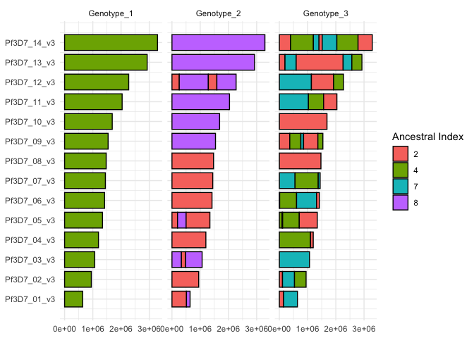

<!-- README.md is generated from README.Rmd. Please edit that file -->

# recombuddy

<!-- badges: start -->

<!-- badges: end -->

The goal of *recombuddy* is to simulate *Plasmodium* genetic data in a
way that captures realistic patterns of polyclonality and within-sample
relatedness. It achieves this using a simple statistical model of
recombination, where the genome is partitioned into blocks that each
inherit from a specified ancestral haplotype. This approach allows for
the generation of mosaic genomes that reflect the structure and
complexity commonly observed in real infections, while avoiding full
genomic transmission modelling.

## Installation

Install *recombuddy* from [GitHub](https://github.com/) with:

``` r
install.packages("devtools")
devtools::install_github("PlasmoGenEpi/recombuddy@v1.0.2")
```

Notice we have used a tagged version number here to avoid issues with
backward compatibility. The most up-to-date version is **v1.0.2** - see
the end of this README for a version history.

## Example

There are two layers to simulation in *recombuddy*:

1.  **Simulating recombination blocks that reference an ancestral
    population**. New haploid genotypes are simulated as mosaics of
    ancestral identifiers, where each block inherits from one of $`N`$
    ancestral haplotypes. These integer-valued mosaics specify ancestry
    but do not carry genetic sequence data themselves. Multiple haploid
    genotypes can be combined to produce polyclonal samples.
2.  **Simulating entirely synthetic genotypes from allele frequency
    distributions**. In this mode, the ancestral haplotypes themselves
    are simulated by drawing alleles at specified loci from a
    user-defined allele frequency distribution. The recombination
    framework remains the same, but the ancestral population is
    constructed de novo.

### Simulating blocks of inheritance

Let’s imagine we have 10 genotypes in our ancestral population:

``` r
n_set <- 10
```

Our first decision is how frequently each genotype should be sampled. In
many scenarios - such as low-transmission or outbreak settings - a small
number of genotypes may dominate the population. This step also allows
us to control the average relatedness *between* samples; that is, the
probability that haploid genotypes from two distinct individuals are
identical by descent (IBD) at a given locus.

Here, we take the statistically principled approach of drawing
proportions from a Dirichlet distribution. The concentration parameter
`alpha` dictates the skew of this distribution, with small values
leading to highly skewed distributions. High skew means a high chance of
sampling the same individual multiple times, which can lead to
relatedness between distinct samples. Flipping this argument around, if
we define the parameter `f` to be the probability of identity by descent
between two samples, then we can calculate `alpha` directly from `f` as
follows:

``` r
# define concentration parameter of the Dirichlet distribution directly from f
f <- 0.1
alpha <- (1 - f) / f

# draw proportions of each member of the ancestral population
ancestral_props <- rdirichlet_single(n_set, alpha = alpha)
ancestral_props
#>  [1] 0.026699104 0.243224692 0.012984787 0.318369030 0.036088779 0.210935723
#>  [7] 0.028352619 0.064805150 0.001442449 0.057097667
```

Next, we simulate a single polyclonal sample using `sim_sample()`.
Arguments to this function are:

- `k`: a vector of values specifying the number of serial meioses for
  each haploid genotype in the sample. There is one value per haploid
  genotype, meaning the length of this vector specifies the complexity
  of infection (COI). When `k[i]=0` there is no meiosis, and values are
  copied over exactly from the ancestral population. When `k[i]=1` there
  is a single meiosis of two members of the ancestral population. When
  `k[i]=2` there are two serial meioses starting with four members of
  the ancestral population, and so on. Higher values of `k` tend to
  produce a greater number of smaller blocks, with the potential for
  more complex patterns of inheritance. A more detailed description of
  the statistical model can be found
  [here](R_ignore/recombuddy_model.pdf)
- `rho`: the recombination rate per-site, per-meiosis. By default set to
  the value 7.4e-7 from Miles et al. (2016).
- `set_props`: the sampling probabilities of each member of the
  ancestral population.

Let’s generate a sample with COI=3:

``` r
# simulate a single sample
samp1 <- sim_sample(k = c(0, 1, 2), set_props = ancestral_props)
```

The output of `sim_sample()` is a list with one element per haploid
genotype, therefore three elements in this example. Each haploid
genotype has the following components:

``` r
names(samp1$genotypes[[1]])
#> [1] "is_nonrecomb"    "index_nonrecomb" "segments"
```

`is_nonrecomb` states whether this genotype was produced as a direct
copy from the ancestral population with no meiosis. We already know this
from the vector `k`, i.e. if we set `k[i]=0` then there will be no
meiosis, but this information is repeated here for book-keeping. The
`index_nonrecomb` element states which member of the ancestral
population was copied from. Both of these elements are for convenience,
the idea being that if we know that a haploid genotype was an exact copy
then it may streamline our downstream bioinformatic pipeline.

The most important simulation output is the `segments` object. This
details which member of the ancestral population is inherited from (the
`index`) for a series of segments that make up the entire genome. Here
is what is looks like for the first haploid genome (no meiosis):

``` r
samp1$genotypes[[1]]$segments
#> # A tibble: 14 × 4
#>    chrom       start     end index
#>    <chr>       <dbl>   <dbl> <int>
#>  1 Pf3D7_01_v3     0  640851     4
#>  2 Pf3D7_02_v3     0  947102     4
#>  3 Pf3D7_03_v3     0 1067971     4
#>  4 Pf3D7_04_v3     0 1200490     4
#>  5 Pf3D7_05_v3     0 1343557     4
#>  6 Pf3D7_06_v3     0 1418242     4
#>  7 Pf3D7_07_v3     0 1445207     4
#>  8 Pf3D7_08_v3     0 1472805     4
#>  9 Pf3D7_09_v3     0 1541735     4
#> 10 Pf3D7_10_v3     0 1687656     4
#> 11 Pf3D7_11_v3     0 2038340     4
#> 12 Pf3D7_12_v3     0 2271494     4
#> 13 Pf3D7_13_v3     0 2925236     4
#> 14 Pf3D7_14_v3     0 3291936     4
```

Notice that we have a single segment per chromosome, with the same
ancestor over this entire genome. This is what we would expect with no
meiosis.

Here is what it looks like for the `k[2]=1` case (single meiosis):

``` r
samp1$genotypes[[2]]$segments
#> # A tibble: 22 × 4
#>    chrom        start     end index
#>    <chr>        <dbl>   <dbl> <int>
#>  1 Pf3D7_01_v3      0  513918     2
#>  2 Pf3D7_01_v3 513918  640851     8
#>  3 Pf3D7_02_v3      0  947102     2
#>  4 Pf3D7_03_v3      0  334501     8
#>  5 Pf3D7_03_v3 334501  482451     2
#>  6 Pf3D7_03_v3 482451 1067971     8
#>  7 Pf3D7_04_v3      0 1200490     2
#>  8 Pf3D7_05_v3      0  197194     2
#>  9 Pf3D7_05_v3 197194  500981     8
#> 10 Pf3D7_05_v3 500981 1343557     2
#> # ℹ 12 more rows
```

Now we have some segments that are smaller than the whole chromosome,
and the genotype is a mosaic of ancestral individuals 2 and 8.

Here is what it looks like for the `k[3]=2` case (two serial meioses):

``` r
samp1$genotypes[[3]]$segments
#> # A tibble: 44 × 4
#>    chrom         start     end index
#>    <chr>         <dbl>   <dbl> <int>
#>  1 Pf3D7_01_v3       0  152354     2
#>  2 Pf3D7_01_v3  152354  640851     7
#>  3 Pf3D7_02_v3       0  111287     2
#>  4 Pf3D7_02_v3  111287  536449     7
#>  5 Pf3D7_02_v3  536449  947102     4
#>  6 Pf3D7_03_v3       0 1067971     7
#>  7 Pf3D7_04_v3       0 1103378     4
#>  8 Pf3D7_04_v3 1103378 1200490     2
#>  9 Pf3D7_05_v3       0   96195     4
#> 10 Pf3D7_05_v3   96195  116812     2
#> # ℹ 34 more rows
```

Now we have more complex blocks composed of individuals 2, 4, and 7. The
reason there are only 3 ancestors here when there should be 2^2=4 is
that the same ancestor was chosen twice by chance.

Let’s combine these three data.frames together into a single object:

``` r
# get all genotypes into a single table
df_all_genotypes <- get_all_genotypes(samp1)
df_all_genotypes
#> # A tibble: 80 × 5
#>    genotype chrom       start     end index
#>       <int> <chr>       <dbl>   <dbl> <int>
#>  1        1 Pf3D7_01_v3     0  640851     4
#>  2        1 Pf3D7_02_v3     0  947102     4
#>  3        1 Pf3D7_03_v3     0 1067971     4
#>  4        1 Pf3D7_04_v3     0 1200490     4
#>  5        1 Pf3D7_05_v3     0 1343557     4
#>  6        1 Pf3D7_06_v3     0 1418242     4
#>  7        1 Pf3D7_07_v3     0 1445207     4
#>  8        1 Pf3D7_08_v3     0 1472805     4
#>  9        1 Pf3D7_09_v3     0 1541735     4
#> 10        1 Pf3D7_10_v3     0 1687656     4
#> # ℹ 70 more rows
```

We can now produce a simple visualization of the blocks:

``` r
# plot
plot_genotypes(df_all_genotypes)
```


``` r
# plot with chromosome names displayed

plot_genotypes(df_all_genotypes) + ggplot2::theme_minimal()
```



This plot displays the complex pattern of relatedness between haploid
genomes.

If our plan is to pull directly from a reference panel of haploid
genotypes, then the role of *recombuddy* ends here. We can take the
output in the `segments` elements and pass into our downstream
bioinformatic pipeline to produce synthetic genotypes.

## Simulating a whole population

With function `sim_population` we can simulate a whole final population
with parameters to generate COIs and serial meiosis events from
distriubutions

``` r
# generate off a set of 100 samples, generate 3 new samples 
# pop_alpha 9 (~10% between sample relatedness)
# coi_r = 0.25, coi_p = 0.7 (COI mean of 1.256, ~80.4% proportion will be monoclonal)
# k_s = 0.5 (50% of genotypes will be recombinant)
pop1 = sim_population(paste0("sample", seq(0,100,1)), 3, pop_alpha = 9, coi_r = 0.25, coi_p = 0.7, k_s = 0.5)
```

``` r
library(ggplot2)
for(samp in seq_along(pop1$simulated_samples)){
  # get all genotypes into a single table
  df_all_genotypes <- get_all_genotypes(pop1$simulated_samples[[samp]])
  # plot
  print(plot_genotypes(df_all_genotypes) + theme_minimal() + labs(title = paste0("Sample ", samp)) )
}
```


### Intersecting with regions of interest

Utility functions exist to intersect a simulated sample(s) with a
genomic locations of interest (e.g. SNPs, amplicon panels). Genomic
locations to intersect with must have 4 columns: chrom (character),
start (numeric), end(numeric), target(character). **The chromosome names
must match up with the chromosome names used for the simulations.**

``` r
panel <- tibble::tibble(chrom = c("Pf3D7_04_v3", "Pf3D7_05_v3"), start = c(748173, 958071), end = c(748361, 958206), target = c("dhfr-1", "dhps-1"))
# simulate pop_alpha 9 (~10\% between sample relatedness), coi_r = 0.25, coi_p = 0.7 (COI mean of 1.256, ~80.4 proportion will be monoclonal), k_s = 0.5 (50\% of genotypes will be recombinant)
pop1 = sim_population(paste0("sample", seq(0,100,1)), 5, pop_alpha = 9, coi_r = 0.25, coi_p = 0.7, k_s = 0.5)
intersect_panel_with_simulated_population(panel, pop1)
#> Joining with `by = join_by(index)`
#> # A tibble: 10 × 8
#>    chrom        start    end target within_sample_genotype ancestral_index
#>    <chr>        <dbl>  <dbl> <chr>                   <int>           <int>
#>  1 Pf3D7_04_v3 748173 748361 dhfr-1                      1              45
#>  2 Pf3D7_05_v3 958071 958206 dhps-1                      1              45
#>  3 Pf3D7_04_v3 748173 748361 dhfr-1                      1              48
#>  4 Pf3D7_05_v3 958071 958206 dhps-1                      1              66
#>  5 Pf3D7_04_v3 748173 748361 dhfr-1                      1              27
#>  6 Pf3D7_05_v3 958071 958206 dhps-1                      1              27
#>  7 Pf3D7_04_v3 748173 748361 dhfr-1                      1              72
#>  8 Pf3D7_05_v3 958071 958206 dhps-1                      1              72
#>  9 Pf3D7_04_v3 748173 748361 dhfr-1                      1             101
#> 10 Pf3D7_05_v3 958071 958206 dhps-1                      1              72
#> # ℹ 2 more variables: simulated_sample <int>, ancestral_genotype <chr>
```

## Simulating the ancestral population

``` r
# get all genotypes into a single table
df_all_genotypes <- get_all_genotypes(samp1)
df_all_genotypes
#> # A tibble: 80 × 5
#>    genotype chrom       start     end index
#>       <int> <chr>       <dbl>   <dbl> <int>
#>  1        1 Pf3D7_01_v3     0  640851     4
#>  2        1 Pf3D7_02_v3     0  947102     4
#>  3        1 Pf3D7_03_v3     0 1067971     4
#>  4        1 Pf3D7_04_v3     0 1200490     4
#>  5        1 Pf3D7_05_v3     0 1343557     4
#>  6        1 Pf3D7_06_v3     0 1418242     4
#>  7        1 Pf3D7_07_v3     0 1445207     4
#>  8        1 Pf3D7_08_v3     0 1472805     4
#>  9        1 Pf3D7_09_v3     0 1541735     4
#> 10        1 Pf3D7_10_v3     0 1687656     4
#> # ℹ 70 more rows
```

We may want to simulate an ancestral population, rather than using real
data. If so, we start by setting the positions of the loci of interest
along the genome. These can be defined manually, but we will use a
convenience function to draw uniformly along the genome:

``` r
# draw positions of loci along the genome
df_loci <- draw_loci(n_loci = 2e3)
df_loci
#> # A tibble: 2,000 × 2
#>    chrom         pos
#>    <chr>       <int>
#>  1 Pf3D7_01_v3  2019
#>  2 Pf3D7_01_v3  5332
#>  3 Pf3D7_01_v3 17131
#>  4 Pf3D7_01_v3 26267
#>  5 Pf3D7_01_v3 36279
#>  6 Pf3D7_01_v3 42342
#>  7 Pf3D7_01_v3 52640
#>  8 Pf3D7_01_v3 55148
#>  9 Pf3D7_01_v3 56528
#> 10 Pf3D7_01_v3 74367
#> # ℹ 1,990 more rows
```

Next, we need to simulate population-level allele frequencies (PLAFs) at
all loci. We can do this by drawing from a Beta distribution with shape
parameters that define the allele frequency distribution:

``` r
# draw PLAFs at specified loci
df_PLAF <- draw_PLAF(df_loci = df_loci, beta_shape1 = 0.5, beta_shape2 = 0.5)
df_PLAF
#> # A tibble: 2,000 × 3
#>    chrom         pos    PLAF
#>    <chr>       <int>   <dbl>
#>  1 Pf3D7_01_v3  2019 0.820  
#>  2 Pf3D7_01_v3  5332 0.839  
#>  3 Pf3D7_01_v3 17131 0.976  
#>  4 Pf3D7_01_v3 26267 0.476  
#>  5 Pf3D7_01_v3 36279 0.717  
#>  6 Pf3D7_01_v3 42342 0.0954 
#>  7 Pf3D7_01_v3 52640 0.388  
#>  8 Pf3D7_01_v3 55148 0.00504
#>  9 Pf3D7_01_v3 56528 0.913  
#> 10 Pf3D7_01_v3 74367 0.0280 
#> # ℹ 1,990 more rows
```

Now we can simulate the complete ancestral population by drawing from
these PLAFs:

``` r
# draw alleles for each member of the ancestral population
df_sample_set <- draw_sample_set_WSAF(df_PLAF = df_PLAF, n_set = n_set)
df_sample_set
#> # A tibble: 20,000 × 4
#>    index chrom         pos  WSAF
#>    <int> <chr>       <int> <dbl>
#>  1     1 Pf3D7_01_v3  2019     1
#>  2     1 Pf3D7_01_v3  5332     0
#>  3     1 Pf3D7_01_v3 17131     1
#>  4     1 Pf3D7_01_v3 26267     0
#>  5     1 Pf3D7_01_v3 36279     1
#>  6     1 Pf3D7_01_v3 42342     0
#>  7     1 Pf3D7_01_v3 52640     0
#>  8     1 Pf3D7_01_v3 55148     0
#>  9     1 Pf3D7_01_v3 56528     1
#> 10     1 Pf3D7_01_v3 74367     0
#> # ℹ 19,990 more rows
```

Finally, we need to know what proportion of our sample is made up of
each of the three genotypes. We can simulate proportions from a
Dirichlet distribution:

``` r
# draw proportions for each genotype
df_genotype_props <- draw_genotype_props(COI = 3, alpha = 10)
df_genotype_props
#> # A tibble: 3 × 2
#>   genotype  prop
#>      <int> <dbl>
#> 1        1 0.313
#> 2        2 0.222
#> 3        3 0.465
```

We now have everything we need to calculate the true within-sample
allele frequency (WSAF) of our sample. This combines information over
all three haploid genotypes, weighted by their proportions:

``` r
# calculate true within-sample allele frequencies (WSAFs) for the entire sample
df_WSAF <- get_WSAF(df_all_genotypes = df_all_genotypes,
                    df_sample_set = df_sample_set,
                    df_genotype_props = df_genotype_props)
df_WSAF
#> # A tibble: 2,000 × 3
#>    chrom         pos  WSAF
#>    <chr>       <int> <dbl>
#>  1 Pf3D7_01_v3  2019 1    
#>  2 Pf3D7_01_v3  5332 1    
#>  3 Pf3D7_01_v3 17131 1    
#>  4 Pf3D7_01_v3 26267 1    
#>  5 Pf3D7_01_v3 36279 0.687
#>  6 Pf3D7_01_v3 42342 0    
#>  7 Pf3D7_01_v3 52640 0.687
#>  8 Pf3D7_01_v3 55148 0    
#>  9 Pf3D7_01_v3 56528 1    
#> 10 Pf3D7_01_v3 74367 0    
#> # ℹ 1,990 more rows
```

This data.frame gives the true WSAFs, but in reality we only have an
estimate of the WSAF produced by a series of genotyping reads. We can
overlay a read counts model onto the true WSAFs by assuming that
observed WSAFs are beta-binomial around the true value, with a given
read depth and over-dispersion parameter:

``` r
# apply a simple read count model
df_counts <- draw_read_counts(df_WSAF = df_WSAF, depth = 100, overdisp = 0.01)
df_counts
#> # A tibble: 2,000 × 4
#> # Rowwise: 
#>    chrom         pos   REF   ALT
#>    <chr>       <int> <dbl> <dbl>
#>  1 Pf3D7_01_v3  2019   100     0
#>  2 Pf3D7_01_v3  5332   100     0
#>  3 Pf3D7_01_v3 17131   100     0
#>  4 Pf3D7_01_v3 26267   100     0
#>  5 Pf3D7_01_v3 36279    72    28
#>  6 Pf3D7_01_v3 42342     0   100
#>  7 Pf3D7_01_v3 52640    75    25
#>  8 Pf3D7_01_v3 55148     0   100
#>  9 Pf3D7_01_v3 56528   100     0
#> 10 Pf3D7_01_v3 74367     0   100
#> # ℹ 1,990 more rows
```

Finally, we can plot the observed WSAFs:

``` r
# plot read counts
plot_read_counts(df_counts = df_counts)
```


From this plot we can see the areas of the genome where there is a
signal of relatedness. The different “bands” in this plot correspond to
different combinations of the underlying genotype proportions, produced
by IBD between the haploid genotypes that comprise the sample.

## Version history

- **v1.0.0**, Apr 2025: First public release. Includes all key
  functionality and documentation, including simulating blocks of
  recombination and basic visualization of results.
- **v1.0.1**, Apr 2025: Additional documentation, including pdf giving
  mathematical details of simulation model.
- **v1.0.2**, Apr 2025: Tweaked functions to display chromosome names,
  added more simulation utilities to simulate a new population

## References

<div id="refs" class="references csl-bib-body hanging-indent"
entry-spacing="0">

<div id="ref-miles2016indels" class="csl-entry">

Miles, Alistair, Zamin Iqbal, Paul Vauterin, Richard Pearson, Susana
Campino, Michel Theron, Kelda Gould, et al. 2016. “Indels, Structural
Variation, and Recombination Drive Genomic Diversity in Plasmodium
Falciparum.” *Genome Research* 26 (9): 1288–99.

</div>

</div>
